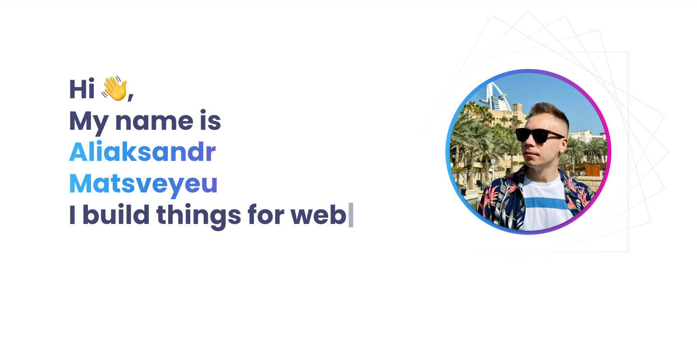

# Portfolio Project on React.js

In this project I used React.js, Styled components, git, figma. I learned how to create components, style them, work with props, decompose and refactor code. The application is adapted to the resolutions of tablets and mobile devices, the layout is responsive. Project link:

## Deploy link: https://matveev96.github.io/PortfolioReact/
